<p align="center"><b>МОНУ НТУУ КПІ ім. Ігоря Сікорського ФПМ СПіСКС</b></p>
<p align="center">
<b>Звіт з лабораторної роботи 1</b><br/>
"Базова обробка зображень"<br/>
дисципліни "Комп'ютерний Зір"
</p>
<p align="right"><b>Студент:</b> <i>Горбуль Андрій Олександрович КВ-11</i><p>
<p align="right"><b>Рік:</b> <i>2024</i><p>

## Завдання
1. Реалізувати процедуру вирівнювання гістограми півтонового зображення.
2. Реалізувати процедуру умовного масштабування півтонового зображення
(приведення значень середнього та дисперсії одного зображення до значень
дисперсії та середнього іншого зображення).
3. Реалізувати процедуру застосування до півтонового зображення довільного
лінійного локального оператора (заданого ядром фільтра).
4. Реалізувати та порівняти процедури згладжування зображень (видалення
шуму) за допомогою прямокутного фільтра, медіанного фільтра, фільтра
Гаусса та сигма-фільтра (спробувати різні комбінації параметрів, підібрати
оптимальні для тестових зображень). При тестуванні бажано брати
зображення, що містять помітний шум (або додати з цією метою випадковий
шум до незашумлених зображень).
5. Реалізувати підвищення різкості зображень за допомогою нерізкого
маскування (спробувати різні комбінації параметрів, в т.ч. різні операції
згладжування, підібрати оптимальні для тестових зображень). При
тестуванні брати розмиті зображення.
6. Реалізувати та порівняти детектори границь для півтонового зображенні на
основі дискретних похідних, операторів Собеля, Шарра, Лапласса, та
оператора Кенні (спробувати різні значення порогів та підібрати оптимальні
для вхідних зображень). При тестуванні брати зображення, що містять
границі.
7. Реалізувати та порівняти детектори границь LoG та DoG. При тестуванні
брати зображення, що містять границі.

## Збірка та виконання програми

Встановити залежності:
```bash
$ sudo make dependencies
```

Зібрати проєкти:
```bash
$ make
```

Запуск програм:
```bash
Open the image:
$ make open

Equilize histogram of the image:
$ make equalize_histogram

Conditional scaling:
$ make scale_conditional

Apply kernels to the image:
$ make apply_kernel

Smooth the image:
$ make smooth

Sharpen the image:
$ make sharp

Edge detection (Sobel, Shcarr, Laplace, Canny):
$ make detect_edges

Edge detection (LoG, DoG):
$ make detect_edges2
```

## Тестування
1. Реалізувати процедуру вирівнювання гістограми півтонового зображення.
<p align="center"> 
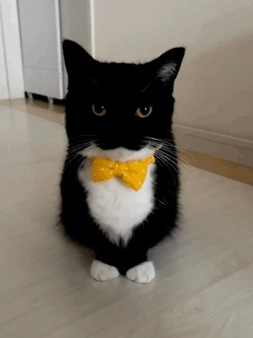

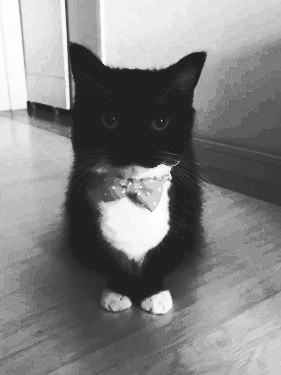
<br>Вхідне зображення; Півтонове; Результат вирівнювання гістограми
</p>

2. Реалізувати процедуру умовного масштабування півтонового зображення
(приведення значень середнього та дисперсії одного зображення до значень
дисперсії та середнього іншого зображення).
<p align="center"> 
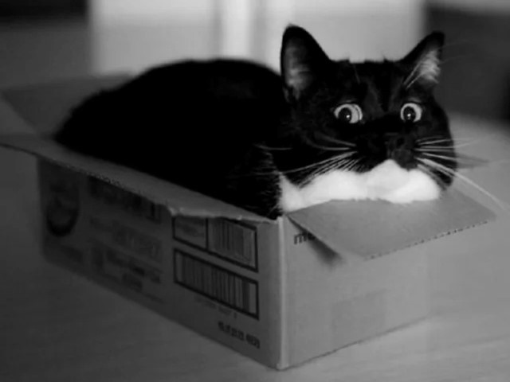

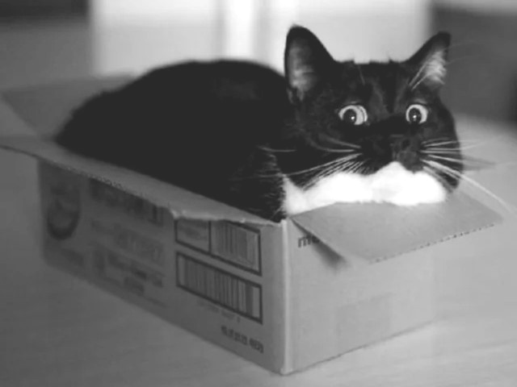
<br>Зображення до масштабування; Референс; Результат умовного масштабування
</p>

3. Реалізувати процедуру застосування до півтонового зображення довільного
лінійного локального оператора (заданого ядром фільтра).
<p align="center"> 

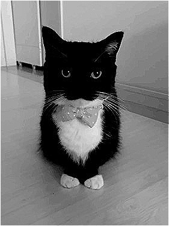

<br>Вхідне зображення; Фільтр підвищення різкості; Фільтр Гаусса<br><br>
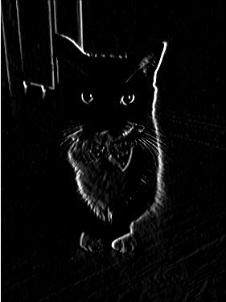
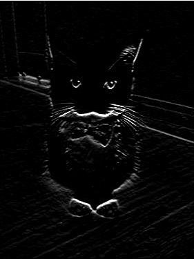
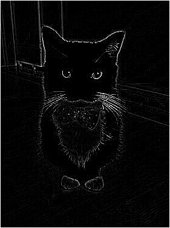
<br>Фільтр Собеля (x); Фільтр Собеля (y); Фільтр знаходження границь<br>
</p>

4. Реалізувати та порівняти процедури згладжування зображень (видалення
шуму) за допомогою прямокутного фільтра, медіанного фільтра, фільтра
Гаусса та сигма-фільтра.
<p align="center">


<br>Вхідне зображення; Півтонове зображення; Зашумлене зображення<br><br>

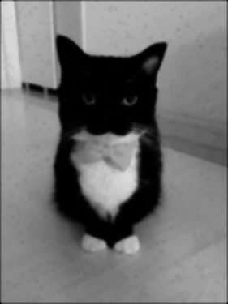


<br>Прямокутний фільтр; Сигма фільтр; Фільтр Гаусса; Медіанний фільтр<br>
</p>

5. Реалізувати підвищення різкості зображень за допомогою нерізкого
маскування.
<p align="center">


<br>Вхідне зображення; Півтонове зображення; Результат нерізкого маскування<br><br>
</p>

6. Реалізувати та порівняти детектори границь для півтонового зображенні на
основі операторів Собеля, Шарра, Лапласса, та оператора Кенні.
<p align="center">
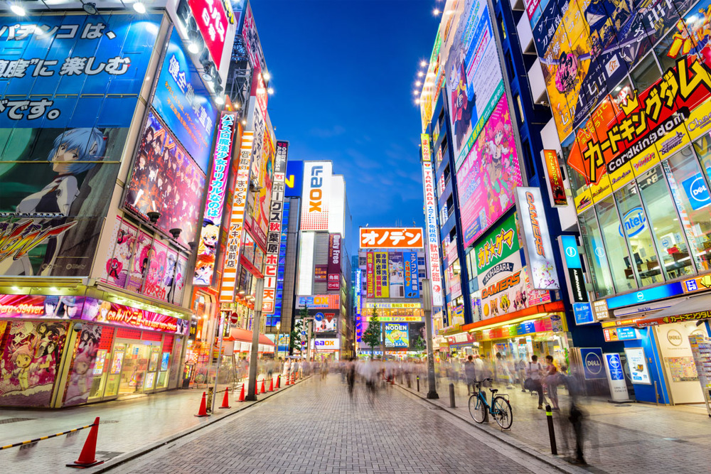
<br>Вхідне зображення<br><br>

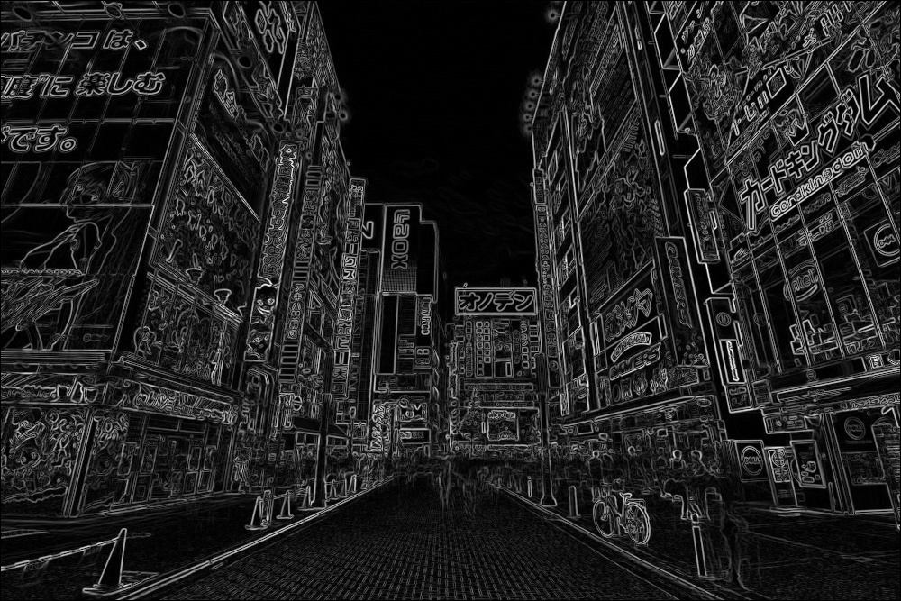
<br>Оператор Собеля; Оператор Шарра<br><br>
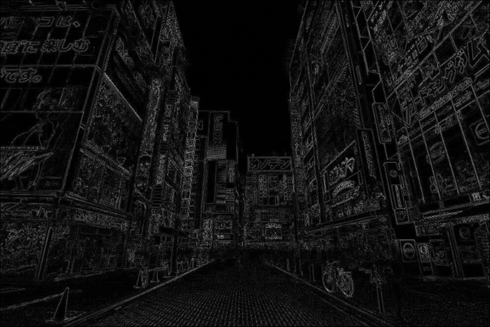
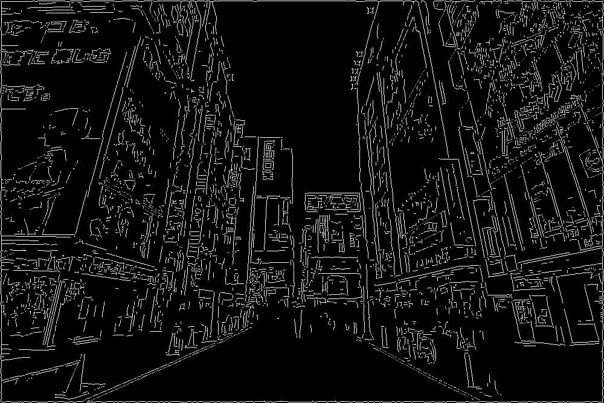
<br>Оператор Лапласса; Оператор Кенні<br>
</p>

7. Реалізувати та порівняти детектори границь LoG та DoG.
<p align="center">

<br>Вхідне зображення<br><br>
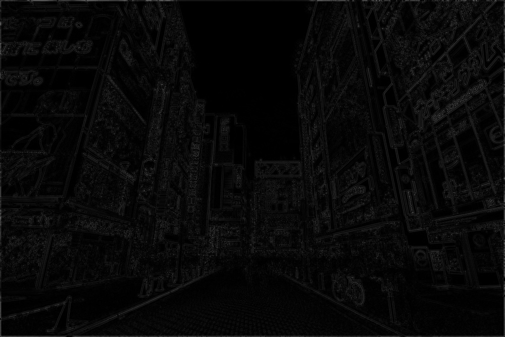
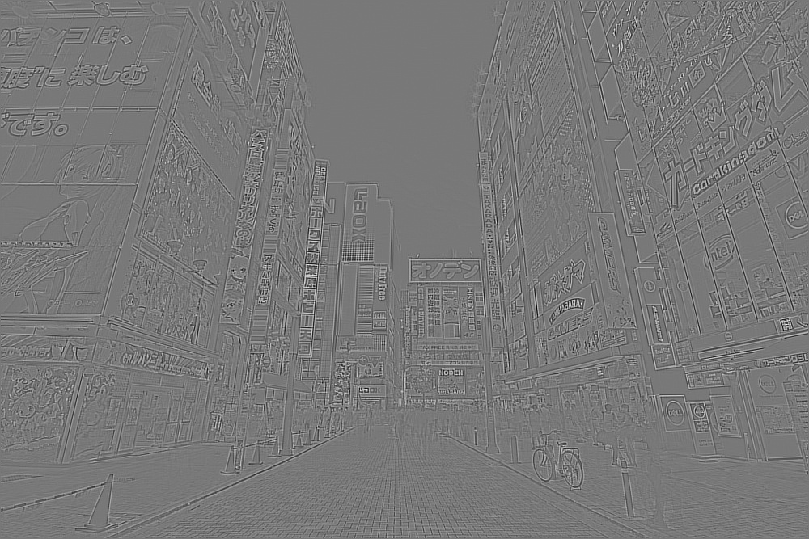
<br>LoG; DoG<br><br>
</p>

## Висновок
У цій лабораторній роботі реалізовано методи базової обробки півтонових зображень:
вирівнювання гістограми, умовне масштабування, застосування лінійних фільтрів, 
згладжування та підвищення різкості.<br>
Із процедур згладжування краще себе показали дві:<br>
Фільтр Гаусса - зберіглось найбільше деталей, але трошки видно шум;<br>
Медіанний фільтр - ідеально прибрались шумні пікселі;<br>
Також були реалізовані та протестовані детектори границь (Собеля, Шарра, Лапласса, Кенні, LoG, DoG).<br>
Найцікавіший з них, як на мене, фільтр Кенні, так як в результаті маємо тільки чітко виражені границі.